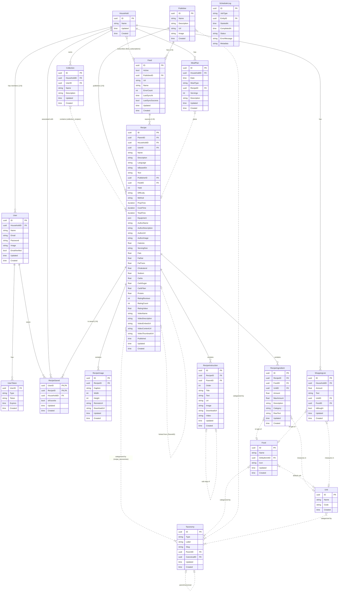

# Database ER Diagram

```mermaid
erDiagram
    %% Core Entities
    User {
        uuid ID PK
        uuid HouseholdID FK
        string Name
        string Email
        string Password
        string Image
        bool EmailVerified
        time Updated
        time Created
    }

    Household {
        uuid ID PK
        string Name
        time Updated
        time Created
    }

    UserToken {
        uuid UserID FK
        string Type
        string Token
        time Expires
        time Created
    }

    %% Recipe Domain
    Recipe {
        uuid ID PK
        uuid ParentID FK
        uuid HouseholdID FK
        uuid UserID FK
        string Name
        string Description
        string Language
        string IsBasedOn
        string Text
        uuid PublisherID FK
        uuid FeedID FK
        int Yield
        string Difficulty
        string Method
        duration PrepTime
        duration CookTime
        duration TotalTime
        json Equipment
        %% Embedded Author
        string AuthorName
        string AuthorDescription
        string AuthorUrl
        string AuthorImage
        %% Embedded Nutrition
        float Calories
        string ServingSize
        float Fats
        float FatSat
        float FatTrans
        float Cholesterol
        float Sodium
        float Carbs
        float CarbSugar
        float CarbFiber
        float Protein
        %% Embedded Rating
        int RatingReviews
        int RatingCount
        float RatingValue
        %% Embedded Video
        string VideoName
        string VideoDescription
        string VideoEmbedUrl
        string VideoContentUrl
        string VideoThumbnailUrl
        %% Timestamps
        time Published
        time Updated
        time Created
    }

    Collection {
        uuid ID PK
        uuid HouseholdID FK
        uuid UserID FK
        string Name
        string Description
        time Updated
        time Created
    }

    %% Explicit Join Models
    RecipeSaved {
        uuid UserID PK, FK
        uuid RecipeID PK, FK
        uuid HouseholdID FK
        bool IsFavorite
        time Updated
        time Created
    }

    %% Supporting Entities
    RecipeImage {
        uuid ID PK
        uuid RecipeID FK
        string Caption
        int Width
        int Height
        string RemoteUrl
        string DownloadUrl
        time Updated
        time Created
    }

    RecipeIngredient {
        uuid ID PK
        uuid RecipeID FK
        uuid FoodID FK
        uuid UnitID FK
        float Amount
        float MaxAmount
        string Description
        string Category
        string RawText
        time Updated
        time Created
    }

    RecipeInstruction {
        uuid ID PK
        uuid RecipeID FK
        uuid ParentID FK
        int Order
        string Title
        string Text
        string Url
        string Image
        string DownloadUrl
        string Video
        time Updated
        time Created
    }

    Food {
        uuid ID PK
        string Name
        uuid DefaultUnitID FK
        string Icon
        time Updated
        time Created
    }

    Unit {
        uuid ID PK
        string Name
        string Code
        time Created
    }

    Taxonomy {
        uuid ID PK
        string Type
        string Label
        string Slug
        uuid ParentID FK
        uuid CanonicalID FK
        time Updated
        time Created
    }

    Publisher {
        uuid ID PK
        string Name
        string Description
        string Url
        string Image
        time Created
    }

    Feed {
        uuid ID PK
        bool Active
        uuid PublisherID FK
        string Url
        string Name
        int ErrorCount
        time LastSyncAt
        bool LastSyncSuccess
        time Updated
        time Created
    }

    SchedulerLog {
        uuid ID PK
        string JobType
        uuid EntityID FK
        time StartedAt
        time CompletedAt
        string Status
        string ErrorMessage
        string Metadata
    }

    MealPlan {
        uuid ID PK
        uuid HouseholdID FK
        time Date
        string MealType
        uuid RecipeID FK
        int Servings
        string Description
        time Updated
        time Created
    }

    ShoppingList {
        uuid ID PK
        uuid HouseholdID FK
        float Amount
        string Text
        uuid UnitID FK
        uuid FoodID FK
        bool IsBought
        time Updated
        time Created
    }

    %% Relationships

    %% User & Household
    Household ||--o{ User : "has members (1:N)"
    User ||--o{ UserToken : "has"
    User ||--o{ RecipeSaved : "saves"
    Household ||--o{ RecipeSaved : "associated with"
    Recipe ||--o{ RecipeSaved : "is saved (1:N)"

    %% M:N Relationships
    Household }|..|{ Feed : "subscribes (feed_subscriptions)"
    Collection }|..|{ Recipe : "contains (collection_recipes)"

    Recipe }|..|{ Taxonomy : "categorized by (recipe_taxonomies)"
    Food }|..|{ Taxonomy : "categorized by"
    Publisher }|..|{ Taxonomy : "categorized by"
    Unit }|..|{ Taxonomy : "categorized by"

    %% Direct Relationships
    Household ||--o{ Collection : "owns"
    Household ||--o{ MealPlan : "has"
    Household ||--o{ ShoppingList : "has"

    Publisher ||--o{ Recipe : "publishes (1:N)"
    Publisher ||--o{ Feed : "has (1:N)"
    Feed ||--o{ Recipe : "sources (1:N)"

    Recipe |o..o| Recipe : "forked from (ParentID)"

    Recipe ||--o{ RecipeImage : "contains"
    Recipe ||--o{ RecipeIngredient : "contains"
    Recipe ||--o{ RecipeInstruction : "contains"

    RecipeIngredient }|..o| Unit : "measures in"
    RecipeIngredient }|..o| Food : "is type of"

    RecipeInstruction |o..o| RecipeInstruction : "sub-step of"

    Food }|..o| Unit : "default unit"

    Taxonomy |o..o| Taxonomy : "parent/canonical"

    MealPlan }|..o| Recipe : "plans"
    ShoppingList }|..o| Unit : "measures in"
    ShoppingList }|..o| Food : "is type of"
```
